# Assessment Task 2: Web Application Project
## Identifying and Defining
### Divergent Thinking
#### Mind Map 

#### 6 Big Ideas Table
| Idea Name | What it does | Influences it Explores | Who it Helps |
|--|--|--|--|
| Art Resources Website | Acts as a collection of resources for artists including useful tutorials, websites, tools, apps, specific artist accounts to follow. May also have an interactive section where users can submit mini doodles for a gallery. | Helping people advance their creativity/art capacity | Artists |
| CC Rubbish Picking | Game-like web app where you can see real areas of Central Coast and its rubbish and simulate picking them up, with also an included map with areas with high pollution in local areas. | Pollution in local environments/communities | Central Coast residents/environment |
| Book Matching | Interactive swiping web app where users read short quotes and extracts of an unknown book and can swipe left or right to show interest, and can match with a book to read! | Reading and books as positive media | Bookworms, generally anyone interested in reading |
| AI or Not Guesser | Guessing interactive web-app where you guess if images/videos are AI to familiarise key indicators of AI use in media and raising caution with information you find online. | Raising awareness about AI misinformation | Anyone, people who can't recognise AI/aren't informed |
| Social Media Visual Story Website | Interactive story website where you click buttons and help a teen navigating social media. | Social media and FOMO | Young teens/adults  |
| Study Focus Help | Sets a study timer where a 'buddy' watches you and helps you focus and gives you tips when you ask. You also have the option to enter your assessment schedule and gives you a spaced repetition plan. | Procastination and school stress | students, people who struggle to focus |

### Convergent Thinking
#### Impact VS Effort Matrix

#### Peer SWOT Analysis
 

#### Self Reflection 
This peer SWOT analysis has provided me insightful opinions into my websites and their potential strengths and weaknesses when implemented. Based on the feedback I've received, it seems that the 'AI or Not Guesser' had a strong impact relevant to modern technology, however there were many flaws in it including its difficult implementation and its ineffectiveness and indurability as a helpful tool as AI advances. This insight has now allowed me to narrow my idea down to the 'Art Resources Website', which seems to be the safer option due to its more longer lasting impact, although it is for a more specific audience, as well as its simpler design. For this project, I will be going through with this 'Art Resources Website', especially considering the time constraints and my current limited HTML ability while keeping in consideration the weaknesses and threats they have outlined for this idea.

**Final Project Idea:** Art Resources Website

#### Functional Requirements
1. **App Catalogue**: User can filter through and find art applications and their ratings, advantages/disadvantages based on filters like pricing, application use etc.
2. **Useful Websites Page**: Lists a number of websites to use for references and art drills to advance art skills by describing who they are best for and what they do.
3. **Events / Communities**: Outlines annual art events within the art community, links to informational sites/communities.
4. **Self-Promotion Guide**: Gives recommendations to what social media platforms to promote your art on, how to go about it and lists some artist accounts who provide better more detailed tips. If within time constraints, have an interactive spinner of video ideas, current trends/audios to try out.

#### Non-Functional Requirements
1. **Performance**: Pages should load within 1-3 seconds and should perform smoothly, responding to user inputs without a noticeable lag or inaccurate responses (eg. a button leading to the wrong page). Page transitions should assist in making a streamlined and cohesive user experience.
2. **Usability / Accessibility**: UI should be accessible to a wide range of abilities through the use of multimedia elements including audio and graphics. User experiences should also be immersive and highly intuitive, where the user can click buttons, scroll and interact with at least one unique interactive function.
3. **Reliability**: Content in web app should be created through comprehensive research and consideration of its social impact. Any data and ratings included of apps, websites and other resources should be accurate and without bias. It should additionally be made clear to users when content was last updated, how any conclusions were reached and should include a disclaimer if any recommendations do not apply to everyone.
4. **Security**: Program should practice proper data minimisation, encrypt any sensitive user information (eg. username/password) if possible, with basic user input validation where needed.
5. **Maintainability**: Code should be highly structured and broken into smaller components and functions with clear indicative names to promote easy updating and future maintenance. Regular and varied testing should also occur early on throughout development to prevent problematic errors and issues from arising later on during maintenance.
6. **Impactful**: Web app should have a clear positive impact in assisting artists and their creative abilities through effective content (eg. give wide range of options, recommendations, avoid catering to a specific artstyle)

## Researching and Planning
### Explore Existing Ideas

| Existing Idea | Plus | Minus | Implication |
|-|-|-|-|
| 1. Art Rocket (by Clip Studio Paint)(https://www.clipstudio.net/how-to-draw/category/digital-art)| Includes a wide variety of tutorials from different artists, helping users of a variety of skill levels learn and extend their art abilities, as well as support the artists creating the tutorials. | Website structure is a bit cluttered due to lots of text without borders, and is also a bit plain in terms of aesthetics. | Art Rocket and its idea of a dual influence where both sides(the users and the artists) can be positively impacted is something I'd like to integrate in my web app. This website has not displayed the importance of being accessible for everyone, it has also made me consider the value of my web app's branding and aesthetics due to its lack of structure and plain appearance. Moving forward with my project, I believe Art Rocket can act as a reference point to how I can expand my application's influence creatively in a way that is positive for every artist. |
|2. Tech Radar (https://www.techradar.com/pro/best-drawing-apps)| Clear listing of advantages and disadvantages of art software for both beginners and professional artists. Very clear and informational, guides artists on choosing the most personalised application for them. | Lots of scrolling and reading, although that makes it very informational, it undermines its interactivity. | Tech Radar ultimately demonstrates the significance of informational clarity in its UI, through its clear structuring of advantages, disadvantages and concise informative sections. However, its lack of functions other than scrolling has highlighted how being informational can often compromise user engagement. For my project, I will aim to be inspired off the content of their page while working toward making my web app more visually and functionally interesting. |
|3. Creative Bloq (https://www.creativebloq.com/tag/3d-art-inspiration)| Acts as a gallery of recent creative works in the industry that can inspire users in their art. Rather than directly teaching tips or providing resources, Creative Bloq fuels the imagination and creativity of aspiring artists. It also has a strength in that it caters for a variety of media and artistic forms, such as game design, animation, 3D etc. | It's main weakness is the website's overabundance of ads and unsuited colour palette (orange and grey). They make the user interface less appealing and useable. | Creative Bloq provides valuable inspiration for how a website can be creatively influential without any indicative tips and feedback to users. Similar to Art Rocket, it also features a dual influence and exposes users to industry creatives while giving publicity to smaller indie projects. Although its issue of ads does not imply anything for my project, I will make sure to make my web app's branding suitable for its actual content while considering how the web app can be influential through more unique mothods.  |

### Secondary Research

https://www.researchgate.net/publication/397175292_Use_of_Digital_Technologies_in_the_Process_of_Teaching_Art_Education_to_Students_A_Mixed_Methods_Study (digital tools for art is important and help create further access and extension of creative media)
https://www.oii.ox.ac.uk/art-algorithms-new-exhibit-highlights-differences-between-algorithmic-and-human-curation/ (the algorithm limits what we see, black box (makes artists less visible on social media + some art tools are harder to find))
- Research information using data from at least 2-3 reputable sources.
- Discuss your findings in two paragraphs or more and consider how they impact your project moving forward.
  
### Primary Research
**Survey Quantitative Results (Google Form: https://forms.gle/wXYreeE5BL81M3Rt6)**

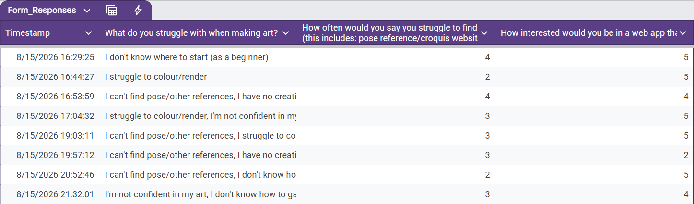
(https://docs.google.com/spreadsheets/d/1Q_IeDcmdabbyJZ9C2-ip9PQsSzEKD-W6XaLb7ekaTR4/edit?usp=sharing)

**Survey Qualitative Results (same Google Form + Face-to-face interviews***

|Google Form Question | Responses | 
|-|-|
|**What kind of art apps/websites/tools do you often look for?**| "Something that enables animation" |
| |"Usually croquis sites and cool creative tools like glitterfying art etc."|
| |"pinterest"|
| |"easily accessible and one with many varieties"|
| |"Google with hopes and prayers, if I can't find what I need I take the picture myself, if I can't take the picture myself I cry myself to sleep"|
| |"I make it a very strong point to NOT use references that are AI generated. I mostly look for pose/composition/character design inspo, but sometimes ill look for irl pics of people for my uni assignments (they make us draw realistic) and very rarely color palettes"|
| |"Pallets" *(probably was referring to colour palettes)*|
| |"I usually watch videos on youtube/insta to look at tips, and pinterest for reference photos of characters im drawing/poses."|
|**Describe how you usually find good resources and art assistive sites**|"I dont use a lot of references, but i usually only use pinterest"|
| |"When it pops up in my feed on social media, or if a friend tells me about it"|
| |"hours of looking"|
| |"look for other peoples recommendations"|
| |"I go on google, and once I find a picture close enough from what I need, I click on it and look at similar pictures below until i find the perfect one"|
| |"I've found a good few through my friends and mutuals, sometimes through reels of people sharing resources. On my own, it's a bit difficult to find resources because it's gotten harder to separate AI generated content from real resources."|
| |"Pinterest or google"|
| |"I dont actively search for them cuz its too hard… (HI ARISAA)"|

`*Note: I posted this Google Forms on my public art account and to people I know in our grade who have an interest in art`

**Interview #1: Lygia**

**Me:** So the issue I'm basically exploring is the difficulty finding art resources, especially digitally. So things like finding the right art apps, animations apps, and finding cool resources and tools to help advance your creativity. I was wondering if you have any experience struggling to pick or find any art resources online?

**Lygia:** Yeah I have, specifically art animation apps. For drawing apps, there are a ton of free apps that provide a lot free stuff to work with, a lot of filters, a lot of brushes. But for animation, animation apps are extremely scarce. They're either expensive or that they are very basic and limited. Like flipaclip makes you pay for layers! Whenever I see someone very talented using an application like flipaclip, I always think 'I wonder what they could make if they more'. 

**Me:** Okay, so my website basically has a whole catalogue of apps, tools and resources with filters for pricing and the kind of purpose it holds such as references, image/video editing and etc. etc. That's like the basic version of my proposal, it also has other features I'm planning on implementing but I just have to ask, would you find it useful?

**Lygia:** I would find it useful and I would use it because sometimes, with the rise of AI and everything, it's really hard to find genuine references and filters that I would want to fully support and use. A website with like lots of links to tools and trinkety stuff would be definitely cool and it'd help artist experiment and bedazzle their work or just get better in general!

**Me:** Yay thanks! Is it possible you could rate the idea on a scale of 1 to 5, and maybe something you specifically would want from the website?

**Lygia:** So the website is basically like giving tips and links to certain things for artists right?

**Me:** Yep!

**Lygia:** I like don't really have particular suggestions but from how you describe it, it sounds really useful and I would rate it 5 out of 5. I really hope that it's executed, but I put my trust in you to execute it well! Hmmmm

**Me:** It doesn't have to be anything related to the idea itself, it's just anything you personally would find useful, as an artist.

**Lygia:** References are my life, literally because I tend to draw for memory and imagination a lot but I usually can't find good references on my own. So I'm kind of stunted in the way of drawing things like interesting buildings and objects, or even animals properly. 

### Primary Research - Evaluation
- Evaluate your findings and consider how it impacts your project moving forward.

### UI/UX Design
Generate and evaluate alternative designs using website wireframes and webpage storyboards. You may do this on paper or using Adobe XD / Figma.
| | Website Wireframe | Webpage storyboard |
|-|-|-|
| Design 1 (visual, structured) | 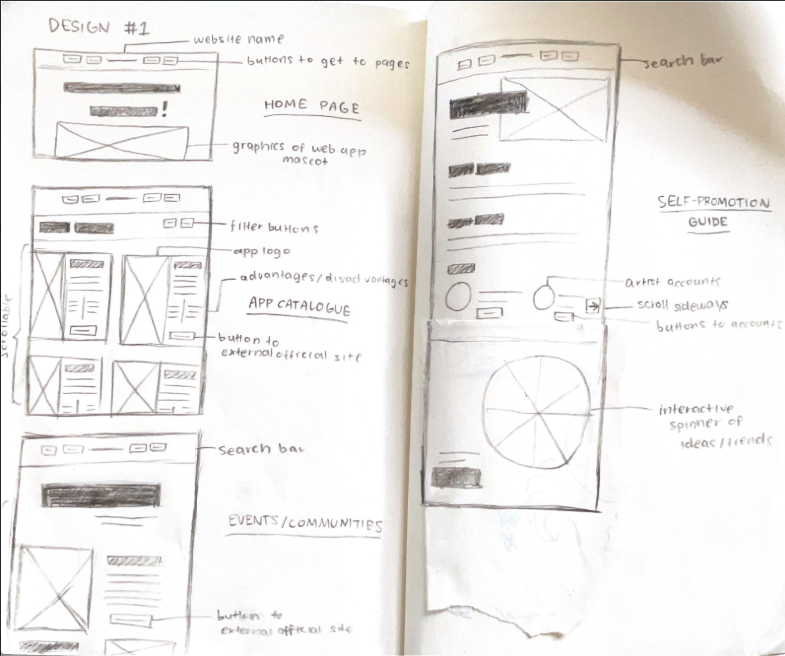 | |
| Design 2 (game-like, interactive) | 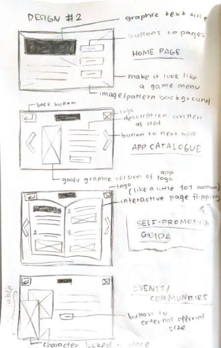 | | 
| Design 3 (similar to design 1, more standard) | 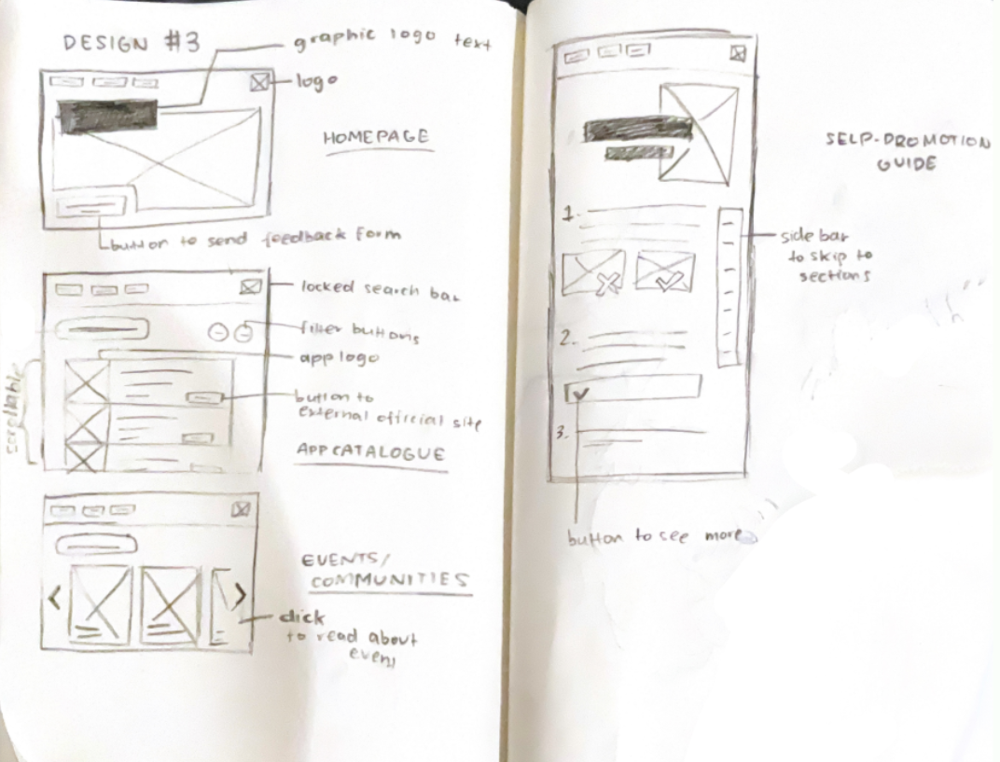 | 

### Prototype

**Adobe XD Link:** https://xd.adobe.com/view/6b1c48d0-c57f-4434-96ea-42c4076293c4-3e4f/

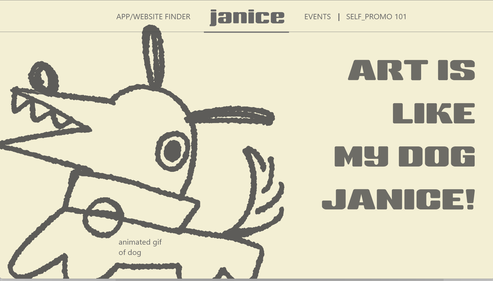
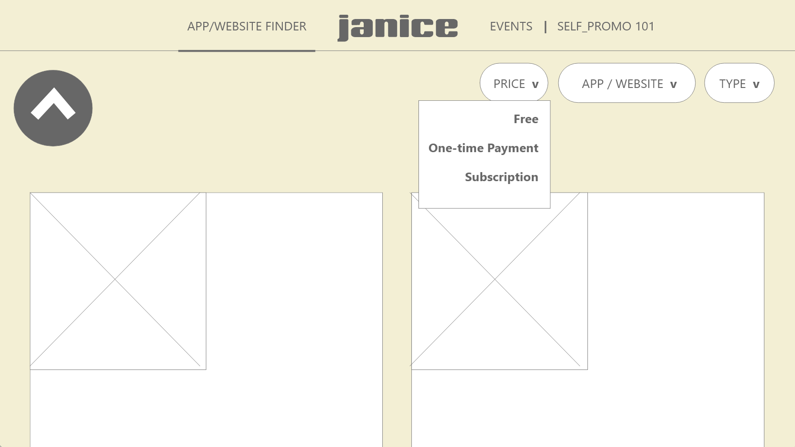

## Producing and Implementing
### Development Process Documentation
Document the whole development process (including all of the above) in a Markdown (.md) file.
- Sophisticated and insightful evaluation throughout the project, consistently reflecting on progress, project requirements, and peer/user feedback, with extensive analysis of required improvements.
#### Week 2
This week has had minimal progress due to being sick during our lesson days, however I have managed to complete the diverge mind map and start the 6 big ideas table at home. Moving forward with this project, I will need to put further consideration into which of my chosen ideas I should go forward with given the time constraints, my HTML ability and its suitability to this project's key idea of influence. Reflecting on the lesson I was present this week, I need to focus much more in class and maximise my productivity so I can put extra time into the development and testing stages later on, as I suspect I will struggle when coding in HTML/CSS and Javascript. Overall, although progress was slow this week, I will aim to finish off the 6 big ideas table quickly and finish at least up until the SWOT diagrams in order to start developing my web application by Week 5 (as Mr Scott recommended).

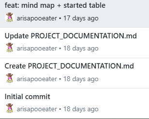

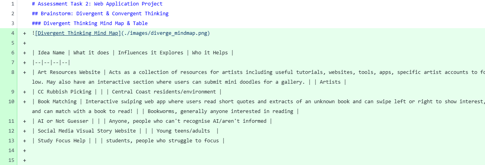

#### Week 3
I completed the impact vs effort matrix over the weekend last week, and have done the SWOT analysis with Yuna and Vanessa. My peers' SWOT analysis feedback provided valuable insight into the strengths I should lean into for this project, such as maximising my use of information and graphics from online, as well as some possible threats to look out for, such as accidentally plagiarising similar art resource websites. I will ensure I keep both positive and negative aspects of my project in mind when going about with designing the user interface and project content. I've additionally drafted a survey for my project on Google Forms and will be planning to release it early next week onto my online art account, to some art friends I know and people in my grade. I am purposefully planning to release it on my public art account as I wish to gain valuable data from real-world artists that are not biased towards me, which may happen if I only send it to people at school or my friends. Since my survey targets a very specific audience, I do not believe I will get many responses so I have also created a short list of questions I plan to ask my artist friend who has agreed to interviewed. Overall, this week has definitely been more productive and I have worked towards getting more work done in class, and although I still get distracted sometimes, I make up for it by doing some of this work at home to stay ahead in this project. I've been trying to be thorough and efficient with my theory progress as I want my project planning to be very comprehensive to help myself figure out where to start when I begin coding, especially as it is in a coding language I'm not familiar with. 
In terms of my project requirements, I think the art resources idea I ultimately ended up choosing was the best out of my options as it aligned with the requirements of having a "clear positive influence for a clear audience", which is for artists. I also believe that this idea will be the easiest to create with HTML, which will hopefully allow me more time for enhancing its visual, interactive and accessibility elements, such as animating some graphics and/or adding a text to speech button. Next week, I need to work more diligently so I can finish all the theory work for this project before Week 5, which is when we plan to start developing the website. This probably means I will also need to invest time into brainstorming the design aspects like the wireframes and storyboards of the project at home. I also will need to release my survey early next week so I can quickly collect the data I need and finish off my planning and design phase before Week 5.

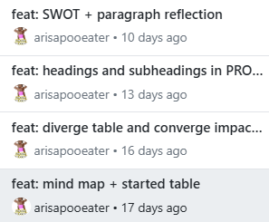

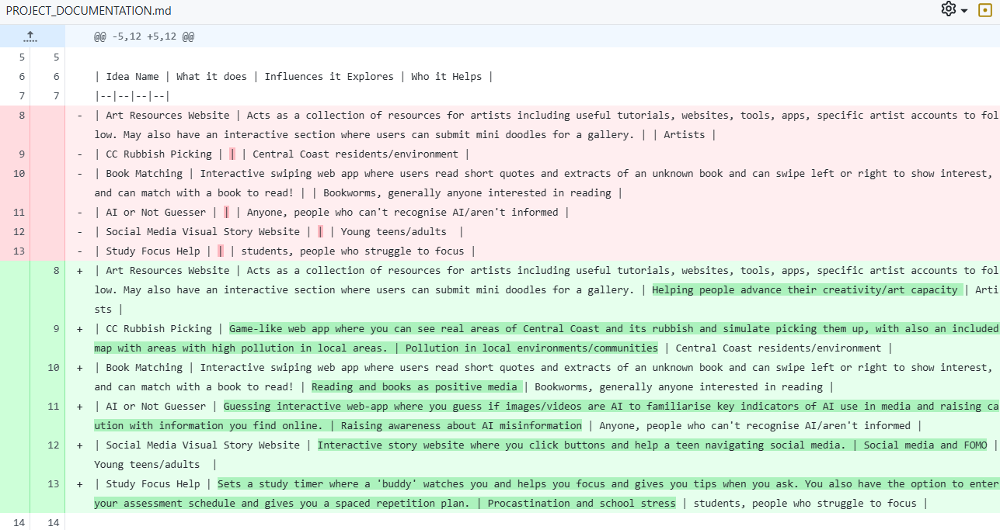

#### Week 4
This week I have made progress in my requirements definition and design theory, where I have finished writing my functional/non-functional requirements and have collected my survey results and put them in both a Markdown and Google Sheets file. I have also completed my website wireframes, however some of my wireframes are not meeting the functional requirements I've outlined as some of them do not contain a proper filter catalogue design. Due to this small issue, I intend to leave editing my wireframes near the end of the project so I can begin development next week. 

Furthermore, the survey results and feedback I received for my project proposal has been positive and most people would find my website relatively or very useful, which is relieving. I found that the common struggles majority of artists experience were not being able to find references, not being confident in their art, and not knowing how to gain a following. With this insight, the survey has brought my awareness to what key areas to focus on, and I will address them with a heavier emphasis within my project. I will do this by including more apps and websites for references, creating a self-promotion guide section, and using a positive and up-lifting tone and message to inspire the audience and increase their confidence with their art.
Some improvements I definitely found with my working habits was that I ignored the secondary research section for a whole week despite having time as I didn't really know what it was asking of me and we had substitute teachers for the whole week. However, I feel like I should've been more proactive, and I could further improve my attitude toward this task by just messaging Mr Scott on Google Classroom if I need help, as I think I'm using excuses to delay starting the task. Ultimately, my goal next week will be to start (or finish) my secondary research and start coding the base structure of my program.

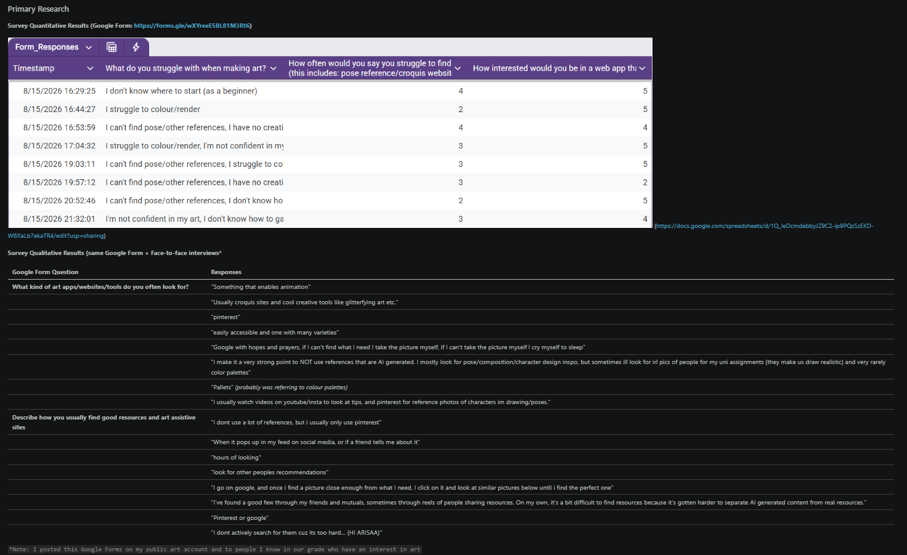
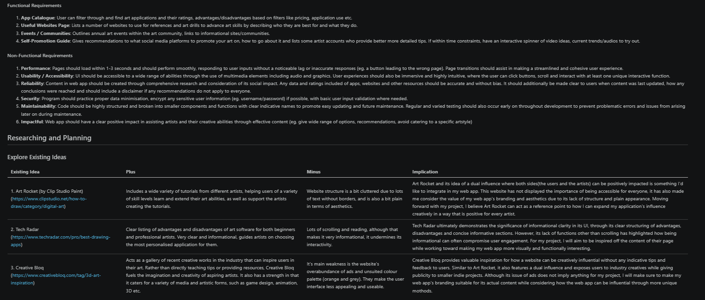
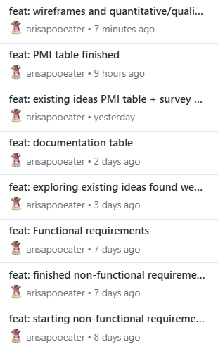

#### Week 5
- progress: starting creating the prototypes of my main functions and searched and found tutorials for the filter catalogue, the navigation bar, and some button animations that id like to implement but alter to my specific idea. I also found that making a flipbook with css and javascript is really simple and implementable (i got the idea when reading a book online using the same script) so I think it'd be cool if the self-promotion 101 simulated a sort of handibook -- which would really help push the creative and handmade branding of the website
- reflection: very productive this week and i've made a lot of progress with the website development. i need to remember that I did leave some theory undone such as the secondary research so I think although I am working at a good pace now, I still need to remember that I still have things to do other than developing the website, such as researching and making the website content and finishing up my unfinished theory
- project requirements: the theory work ive been working on especially relates to the reliability point in my nonfuncitonal requirements, and i think my research depth does align with how informational I was aiming for and most of the content I've created describes applications mainly objectively.
- required improvements: as of currently I don't really have any critiques on my progress and how I'm going about things as I've been really productive this week, and I also did end up asking Mr Scott for clarification on some bits in the task which I neglected doing last week.
- next week goal:  I know I will be going into a dreadful preliminary examination block so my progress will surely slow down but I want to make sure I am still consistently doing SOMETHING, such as making graphics for the website or researching the website content.

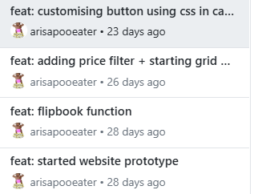

#### Week 6-8 (barely anything but make this one extra long)
- progress: mostly paused developing the website for 2 weeks unfortunately due to my two preliminary examinations. focused on gathering content for the website such as researching a range of applications and their costs and features, some self promotion tips from professional artists and trusted sources. I also wanted the website to be aesthetically creative and artistic which is why I made an animation loop of two cats yawning for the homepage of my website, which I will implement once my exams are finished.
- reflection: it does make me concerned that my progress has been very stunted in the past 3 or so weeks, but I believe that the reason is valid and Computing Tech is just not my priority right now. However, I do believe I am being the most productive I can right now in order to balance CT with my exam studies but not get too behind on the development by focusing on tedious but easy elements like website content. 
- project requirements: I do believe my website aligns vaguely with the functional requirements I've outlined, especially as the performance is mostly consistent discluding some minor errors in the catalogue filter's logic flow, and i did create the content so that it is both thoroughly researched and unbiased. One functional requirement I believe I've been dismissing a lot at the moment is accessibility, as although I purposely increased the sizing of the fonts and several elements in the website, I had originally intended for there to be a text to speech button for my content. However, this is something I will have to either compromise due to a lack of time, or will implement last minute once my content is finalised so I do not need to update audio files repetitively.
- required improvements: i feel like thw ay ive been researching and working is like im creating a draft that i can fix later, but honestly the project is due very soon and i think i should improve this mindset to be more proactive 
- next week goal: get back to implementing the website content i've made so far and further developing and fixing bugs.

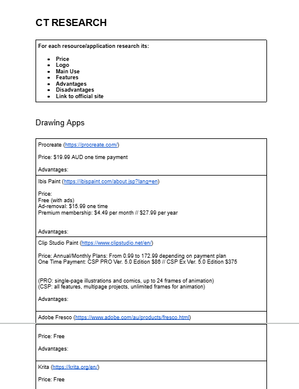
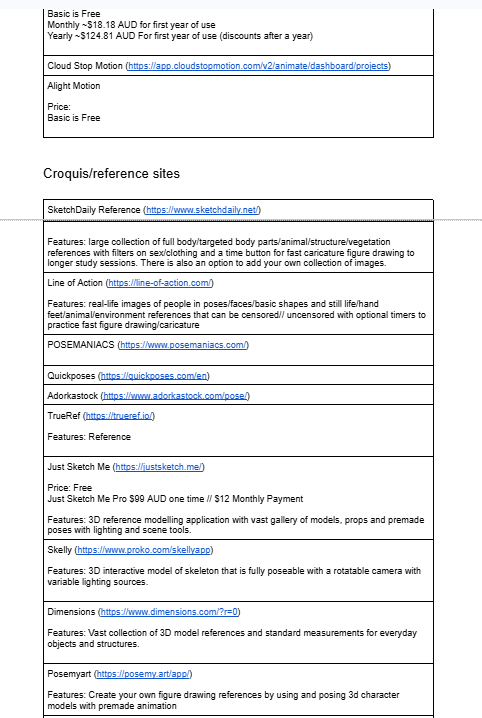

#### Week 9
It is week 9 right now btw

## Testing and Evaluating
### Peer Evaluation
**Evaluate your own project and that of your peers using predetermined criteria.**
### Evaluation of Issues
**Evaluation of your solution in terms of social, ethical, and legal responsibilities / issues.**
### Project Evaluation
**Evaluate the final product in terms of meeting requirements, project management and its impact on the target market.**
