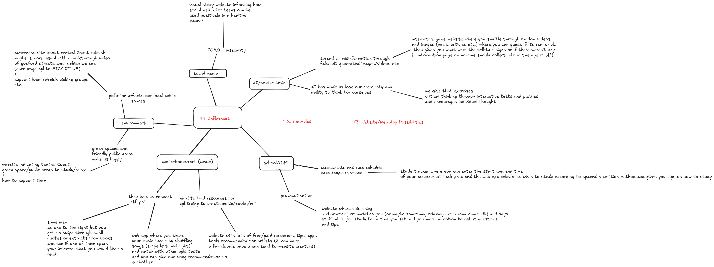
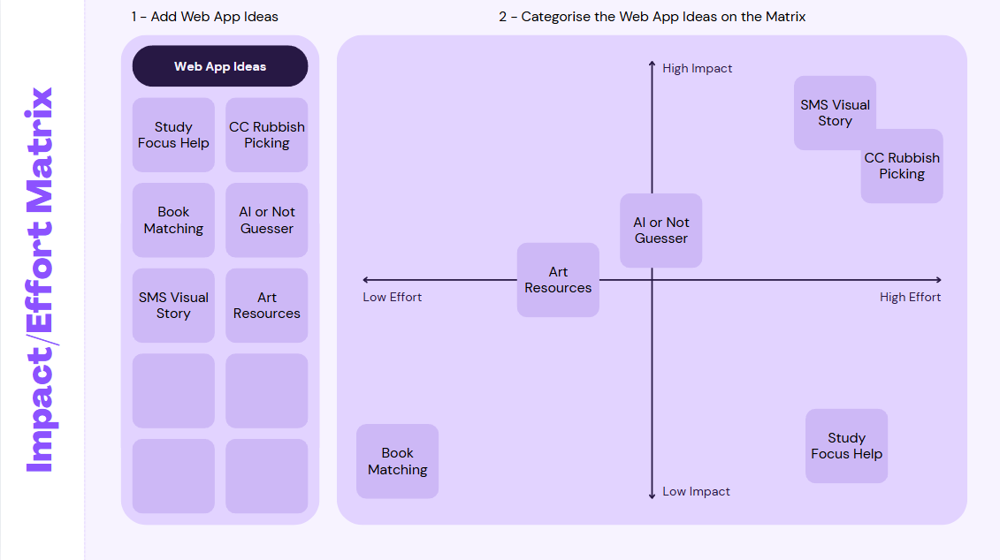
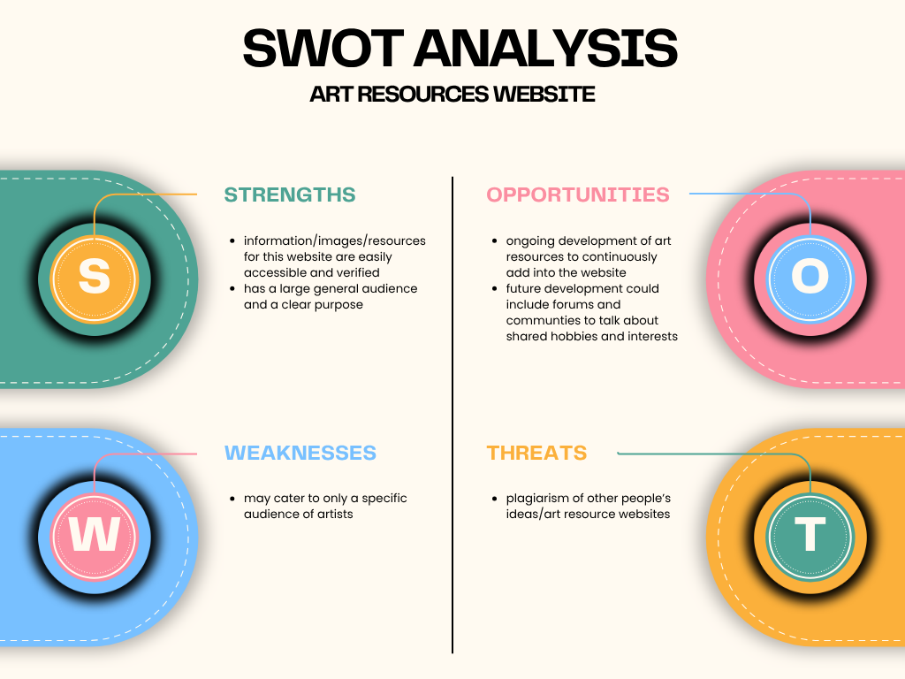
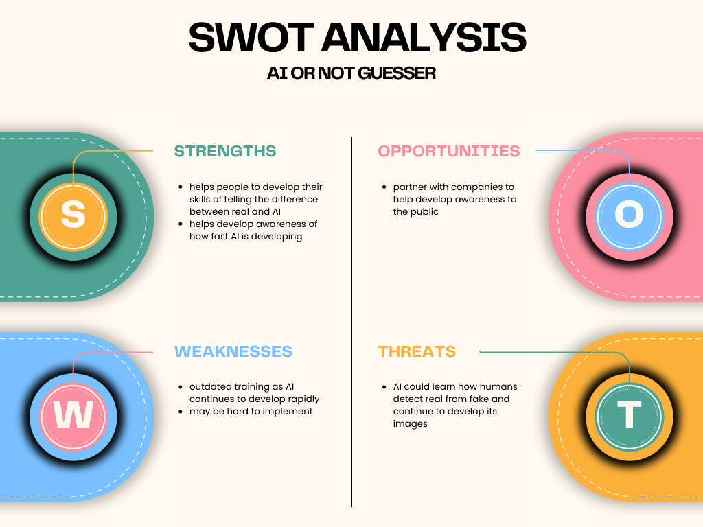

# Assessment Task 2: Web Application Project
## Identifying and Defining
### Divergent Thinking
#### Mind Map 

#### 6 Big Ideas Table
| Idea Name | What it does | Influences it Explores | Who it Helps |
|--|--|--|--|
| Art Resources Website | Acts as a collection of resources for artists including useful tutorials, websites, tools, apps, specific artist accounts to follow. May also have an interactive section where users can submit mini doodles for a gallery. | Helping people advance their creativity/art capacity | Artists |
| CC Rubbish Picking | Game-like web app where you can see real areas of Central Coast and its rubbish and simulate picking them up, with also an included map with areas with high pollution in local areas. | Pollution in local environments/communities | Central Coast residents/environment |
| Book Matching | Interactive swiping web app where users read short quotes and extracts of an unknown book and can swipe left or right to show interest, and can match with a book to read! | Reading and books as positive media | Bookworms, generally anyone interested in reading |
| AI or Not Guesser | Guessing interactive web-app where you guess if images/videos are AI to familiarise key indicators of AI use in media and raising caution with information you find online. | Raising awareness about AI misinformation | Anyone, people who can't recognise AI/aren't informed |
| Social Media Visual Story Website | Interactive story website where you click buttons and help a teen navigating social media. | Social media and FOMO | Young teens/adults  |
| Study Focus Help | Sets a study timer where a 'buddy' watches you and helps you focus and gives you tips when you ask. You also have the option to enter your assessment schedule and gives you a spaced repetition plan. | Procastination and school stress | students, people who struggle to focus |

### Convergent Thinking
#### Impact VS Effort Matrix

#### Peer SWOT Analysis

#### Self Reflection 
This peer SWOT analysis has provided me insightful opinions into my websites and their potential strengths and weaknesses when implemented. Based on the feedback I've received, it seems that the 'AI or Not Guesser' had a strong impact relevant to modern technology, however there were many flaws in it including its difficult implementation and its ineffectiveness and indurability as a helpful tool as AI advances. This insight has now allowed me to narrow my idea down to the 'Art Resources Website', which seems to be the safer option due to its more longer lasting impact, although it is for a more specific audience, as well as its simpler design. For this project, I will be going through with this 'Art Resources Website', especially considering the time constraints and my current limited HTML ability while keeping in consideration the weaknesses and threats they have outlined for this idea.

**Final Project Idea:** Art Resources Website

### Requirements Outline
Your web app should:

Respond clearly to the theme "Influence"

Aim to have a positive social impact (local, national or global)

Be interactive in some way (form, buttons, quiz, media, etc.)

Include a clear message or call to action

Use multimedia elements (e.g. text, images, audio, video, animation)

Be designed with accessibility and user experience in mind

#### Functional Requirements
1. 

#### Non-Functional Requirements
1. **Performance**: Pages should load within 1-3 seconds
2. t%4e
3. **Usability / Accessibility**: UI should be accessible to a wide range of audiences through the use of multimedia elements including audio and graphics. User experiences should also be immersive and highly intuitive, where the user can click buttons, scroll and interact with at least one unique function.
4. **Reliability**:
5. **Security**: Program should practice proper data minimisation, encrypt any sensitive user information (eg. username/password) if possible, with basic user input validation where needed.
6. **Maintainability**:
7. **Impactful**:

## Researching and Planning
### Explore Existing Ideas
- Research information using data from at least 2-3 reputable sources.
- Discuss your findings in two paragraphs or more and consider how they impact your project moving forward.

### Secondary Research
- Research information using data from at least 2-3 reputable sources.
- Discuss your findings in two paragraphs or more and consider how they impact your project moving forward.
  
### Primary Research
- Conduct primary research into your topic. Consider your target market and gather information through surveys, questionnaires and/or interviews. Make sure to include questions to gather quantitative and qualitative data.
- Organise your data (e.g. quantitative into spreadsheet / qualitative into .md file)
- Evaluate your findings and consider how it impacts your project moving forward.

### UI/UX Design
Generate and evaluate alternative designs using website wireframes and webpage storyboards. You may do this on paper or using Adobe XD / Figma.
### Prototype
Create a prototype of at least your home page and one another page from your website using Figma, Adobe XD or a web content management system (CMS).

## Producing and Implementing
### Development Process Documentation
Document the whole development process (including all of the above) in a Markdown (.md) file.

## Testing and Evaluating
### Peer Evaluation
**Evaluate your own project and that of your peers using predetermined criteria.**
### Evaluation of Issues
**Evaluation of your solution in terms of social, ethical, and legal responsibilities / issues.**
### Project Evaluation
**Evaluate the final product in terms of meeting requirements, project management and its impact on the target market.**
