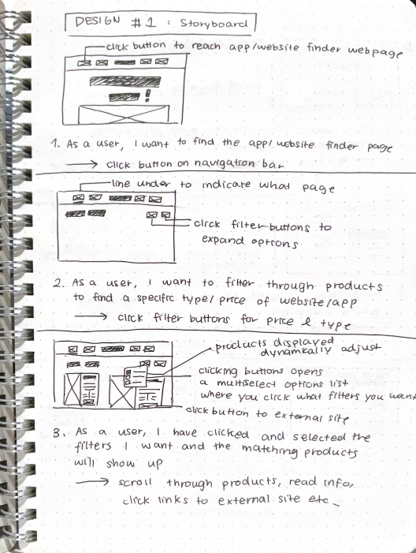
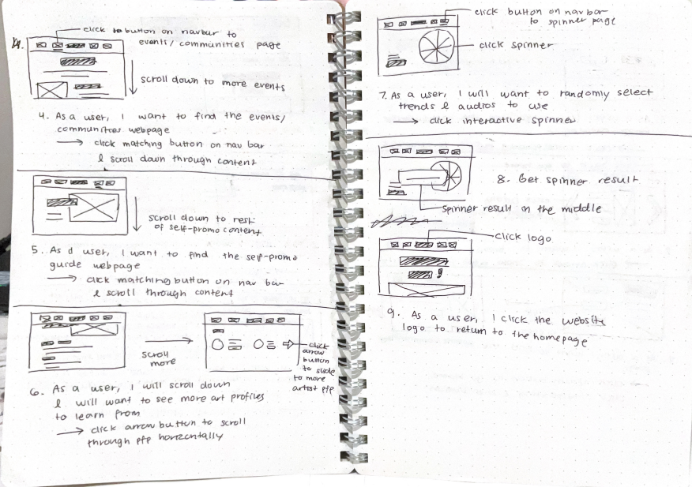
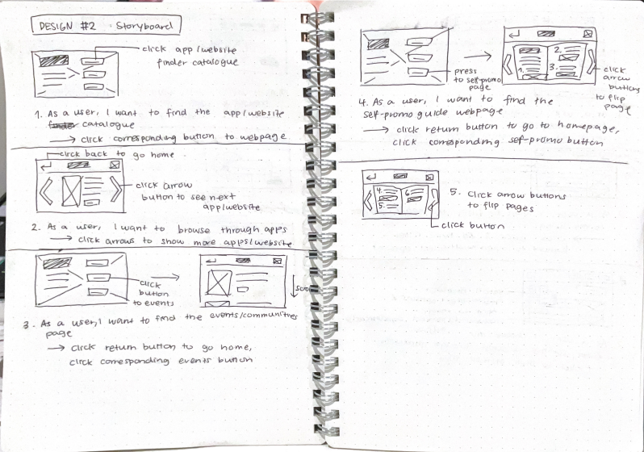
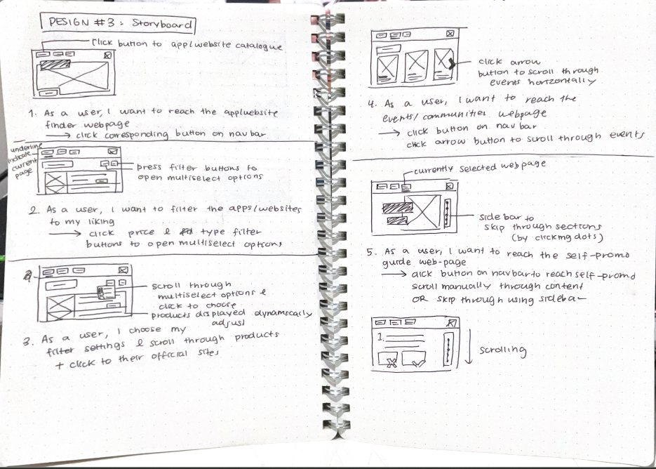

# Assessment Task 2: Web Application Project
## Identifying and Defining
### Divergent Thinking
#### Mind Map 

#### 6 Big Ideas Table
| Idea Name | What it does | Influences it Explores | Who it Helps |
|--|--|--|--|
| Art Resources Website | Acts as a collection of resources for artists including useful tutorials, websites, tools, apps, specific artist accounts to follow. May also have an interactive section where users can submit mini doodles for a gallery. | Helping people advance their creativity/art capacity | Artists |
| CC Rubbish Picking | Game-like web app where you can see real areas of Central Coast and its rubbish and simulate picking them up, with also an included map with areas with high pollution in local areas. | Pollution in local environments/communities | Central Coast residents/environment |
| Book Matching | Interactive swiping web app where users read short quotes and extracts of an unknown book and can swipe left or right to show interest, and can match with a book to read! | Reading and books as positive media | Bookworms, generally anyone interested in reading |
| AI or Not Guesser | Guessing interactive web-app where you guess if images/videos are AI to familiarise key indicators of AI use in media and raising caution with information you find online. | Raising awareness about AI misinformation | Anyone, people who can't recognise AI/aren't informed |
| Social Media Visual Story Website | Interactive story website where you click buttons and help a teen navigating social media. | Social media and FOMO | Young teens/adults  |
| Study Focus Help | Sets a study timer where a 'buddy' watches you and helps you focus and gives you tips when you ask. You also have the option to enter your assessment schedule and gives you a spaced repetition plan. | Procastination and school stress | students, people who struggle to focus |

### Convergent Thinking
#### Impact VS Effort Matrix

#### Peer SWOT Analysis
 

#### Self Reflection 
This peer SWOT analysis has provided me insightful opinions into my websites and their potential strengths and weaknesses when implemented. Based on the feedback I've received, it seems that the 'AI or Not Guesser' had a strong impact relevant to modern technology, however there were many flaws in it including its difficult implementation and its ineffectiveness and indurability as a helpful tool as AI advances. This insight has now allowed me to narrow my idea down to the 'Art Resources Website', which seems to be the safer option due to its more longer lasting impact, although it is for a more specific audience, as well as its simpler design. For this project, I will be going through with this 'Art Resources Website', especially considering the time constraints and my current limited HTML ability while keeping in consideration the weaknesses and threats they have outlined for this idea.

**Final Project Idea:** Art Resources Website

#### Functional Requirements
1. **App Catalogue**: User can filter through and find art applications and their ratings, advantages/disadvantages based on filters like pricing, application use etc.
2. **Useful Websites Page**: Lists a number of websites to use for references and art drills to advance art skills by describing who they are best for and what they do.
3. **Events / Communities**: Outlines annual art events within the art community, links to informational sites/communities.
4. **Self-Promotion Guide**: Gives recommendations to what social media platforms to promote your art on, how to go about it and lists some artist accounts who provide better more detailed tips. If within time constraints, have an interactive spinner of video ideas, current trends/audios to try out.

#### Non-Functional Requirements
1. **Performance**: Pages should load within 1-3 seconds and should perform smoothly, responding to user inputs without a noticeable lag or inaccurate responses (eg. a button leading to the wrong page). Page transitions should assist in making a streamlined and cohesive user experience.
2. **Usability / Accessibility**: UI should be accessible to a wide range of abilities through the use of multimedia elements including audio and graphics. User experiences should also be immersive and highly intuitive, where the user can click buttons, scroll and interact with at least one unique interactive function.
3. **Reliability**: Content in web app should be created through comprehensive research and consideration of its social impact. Any data and ratings included of apps, websites and other resources should be accurate and without bias. It should additionally be made clear to users when content was last updated, how any conclusions were reached and should include a disclaimer if any recommendations do not apply to everyone.
4. **Security**: Program should practice proper data minimisation, encrypt any sensitive user information (eg. username/password) if possible, with basic user input validation where needed.
5. **Maintainability**: Code should be highly structured and broken into smaller components and functions with clear indicative names to promote easy updating and future maintenance. Regular and varied testing should also occur early on throughout development to prevent problematic errors and issues from arising later on during maintenance.
6. **Impactful**: Web app should have a clear positive impact in assisting artists and their creative abilities through effective content (eg. give wide range of options, recommendations, avoid catering to a specific artstyle)

## Researching and Planning
### Explore Existing Ideas

| Existing Idea | Plus | Minus | Implication |
|-|-|-|-|
| 1. Art Rocket (by Clip Studio Paint)(https://www.clipstudio.net/how-to-draw/category/digital-art)| Includes a wide variety of tutorials from different artists, helping users of a variety of skill levels learn and extend their art abilities, as well as support the artists creating the tutorials. | Website structure is a bit cluttered due to lots of text without borders, and is also a bit plain in terms of aesthetics. | Art Rocket and its idea of a dual influence where both sides(the users and the artists) can be positively impacted is something I'd like to integrate in my web app. This website has not displayed the importance of being accessible for everyone, it has also made me consider the value of my web app's branding and aesthetics due to its lack of structure and plain appearance. Moving forward with my project, I believe Art Rocket can act as a reference point to how I can expand my application's influence creatively in a way that is positive for every artist. |
|2. Tech Radar (https://www.techradar.com/pro/best-drawing-apps)| Clear listing of advantages and disadvantages of art software for both beginners and professional artists. Very clear and informational, guides artists on choosing the most personalised application for them. | Lots of scrolling and reading, although that makes it very informational, it undermines its interactivity. | Tech Radar ultimately demonstrates the significance of informational clarity in its UI, through its clear structuring of advantages, disadvantages and concise informative sections. However, its lack of functions other than scrolling has highlighted how being informational can often compromise user engagement. For my project, I will aim to be inspired off the content of their page while working toward making my web app more visually and functionally interesting. |
|3. Creative Bloq (https://www.creativebloq.com/tag/3d-art-inspiration)| Acts as a gallery of recent creative works in the industry that can inspire users in their art. Rather than directly teaching tips or providing resources, Creative Bloq fuels the imagination and creativity of aspiring artists. It also has a strength in that it caters for a variety of media and artistic forms, such as game design, animation, 3D etc. | It's main weakness is the website's overabundance of ads and unsuited colour palette (orange and grey). They make the user interface less appealing and useable. | Creative Bloq provides valuable inspiration for how a website can be creatively influential without any indicative tips and feedback to users. Similar to Art Rocket, it also features a dual influence and exposes users to industry creatives while giving publicity to smaller indie projects. Although its issue of ads does not imply anything for my project, I will make sure to make my web app's branding suitable for its actual content while considering how the web app can be influential through more unique mothods.  |

### Secondary Research

The modern expansion of technology and the internet has consequently affected how art is created through the rise of mediums like digital art, animation and mixed media. Digital art, for one, has enabled artists globally to create illustrations that closely mirror traditional art forms in an accessible way that can experimented with easily. According to "Use of Digital Technologies in the Process of Teaching Art Education to Students: A Mixed Methods Study" on ResearchGate, digital technologies has caused a crucial change specifically in art education where the use of online platforms providing tutorials, virtual lectures and projects have extended the accessibilty of art education to artists from diverse backgrounds and regions. Similarly, a different form of digital art technologies, such as 3D images, virtual reality, computer graphics techniques and digital illustration software such as Pinterest, Blender and Procreate is said to have also amplified the domain of art creation as both a personal interest and as an industry, in the opinion of London College of Contemporary Arts. Therefore, it can be said that digital art tools and software is incredibly valuable for helping artists on a global scale express themselves through creative media.

However, much of what we see online today is largely being affected by online algorithms. Instead of the 1990s emphasis on displaying content by relevance and authority, social platforms and like today utilise algorithmic mechanisms where your data is analysed to curate a feed that is tailored specifically to the content you constantly interact with. Although this has the benefit of personalising users' experiences, several platforms including Instagram have now announced the increasing usage of a "black-box algorithm", where internal decision-making on what is displayed on your feed is kept hidden from users, according to "Art & Algorithms – new exhibit highlights differences between algorithmic and human curation" by Laura Herman, University of Oxford. In terms of art, this is indicative of how the underlying formulas of algorithmic platforms are ill-suited for the display of artistic intention, where the outsourcing of visual culture is causing the reach of artistic expression to be limited and less visible on social media. This engenders an issue for artists growing a presence online or in the industry as  the visibility of their work can become dependent on algorithmic preferences rather than solely on artistic talent, originality and expression. Additionally, the discovery of unique and underground artistic software and tools is also made increasingly difficult as echo chambers and filter bubbles can cause genuinely useful technology to be excluded from user feeds, stunting artistic expression and experimentation.

### Secondary Research - Evaluation
My secondary research has overall highlighted the increasing demand for digital art technology and tools in creative media today. Simultaneously, it explores the issue of finding these resources by providing evidence to how the algorithm in majority of today's platforms work against both promoting these useful tools and technology to users, as well as allowing artists to share their work without being filtered due to low engagement and views. In relation to my project, this reveals that my website would provid as a useful tool as a catalogue with a diverse range of resources for art creation would give artists easy access to useful apps and websites they can use in their creative process. Additionally, the restrictions social media creates around an artist's reach displays a need for artists to be able to navigate the algorithm effectively to push their content onto people's feed and promote themselves. The self-promotion guide I've proposed as a webpage would be invaluable for providing artists who are new to social media on how to post their art and create content so they can see measurable growth in their account. Moving forward with this project, the secondary research can act as a reference point to brainstorming and figuring out how I can help artists combat these issues they're experiencing to optimise this project's positive impact in the art community.

(https://docs.google.com/spreadsheets/d/1Q_IeDcmdabbyJZ9C2-ip9PQsSzEKD-W6XaLb7ekaTR4/edit?usp=sharing)

**Survey Qualitative Results (same Google Form + Face-to-face interviews***

|Google Form Question | Responses | 
|-|-|
|**What kind of art apps/websites/tools do you often look for?**| "Something that enables animation" |
| |"Usually croquis sites and cool creative tools like glitterfying art etc."|
| |"pinterest"|
| |"easily accessible and one with many varieties"|
| |"Google with hopes and prayers, if I can't find what I need I take the picture myself, if I can't take the picture myself I cry myself to sleep"|
| |"I make it a very strong point to NOT use references that are AI generated. I mostly look for pose/composition/character design inspo, but sometimes ill look for irl pics of people for my uni assignments (they make us draw realistic) and very rarely color palettes"|
| |"Pallets" *(probably was referring to colour palettes)*|
| |"I usually watch videos on youtube/insta to look at tips, and pinterest for reference photos of characters im drawing/poses."|
|**Describe how you usually find good resources and art assistive sites**|"I dont use a lot of references, but i usually only use pinterest"|
| |"When it pops up in my feed on social media, or if a friend tells me about it"|
| |"hours of looking"|
| |"look for other peoples recommendations"|
| |"I go on google, and once I find a picture close enough from what I need, I click on it and look at similar pictures below until i find the perfect one"|
| |"I've found a good few through my friends and mutuals, sometimes through reels of people sharing resources. On my own, it's a bit difficult to find resources because it's gotten harder to separate AI generated content from real resources."|
| |"Pinterest or google"|
| |"I dont actively search for them cuz its too hard… (HI ARISAA)"|

`*Note: I posted this Google Forms on my public art account and to people I know in our grade who have an interest in art`

**Interview #1: Lygia**

**Me:** So the issue I'm basically exploring is the difficulty finding art resources, especially digitally. So things like finding the right art apps, animations apps, and finding cool resources and tools to help advance your creativity. I was wondering if you have any experience struggling to pick or find any art resources online?

**Lygia:** Yeah I have, specifically art animation apps. For drawing apps, there are a ton of free apps that provide a lot free stuff to work with, a lot of filters, a lot of brushes. But for animation, animation apps are extremely scarce. They're either expensive or that they are very basic and limited. Like flipaclip makes you pay for layers! Whenever I see someone very talented using an application like flipaclip, I always think 'I wonder what they could make if they more'. 

**Me:** Okay, so my website basically has a whole catalogue of apps, tools and resources with filters for pricing and the kind of purpose it holds such as references, image/video editing and etc. etc. That's like the basic version of my proposal, it also has other features I'm planning on implementing but I just have to ask, would you find it useful?

**Lygia:** I would find it useful and I would use it because sometimes, with the rise of AI and everything, it's really hard to find genuine references and filters that I would want to fully support and use. A website with like lots of links to tools and trinkety stuff would be definitely cool and it'd help artist experiment and bedazzle their work or just get better in general!

**Me:** Yay thanks! Is it possible you could rate the idea on a scale of 1 to 5, and maybe something you specifically would want from the website?

**Lygia:** So the website is basically like giving tips and links to certain things for artists right?

**Me:** Yep!

**Lygia:** I like don't really have particular suggestions but from how you describe it, it sounds really useful and I would rate it 5 out of 5. I really hope that it's executed, but I put my trust in you to execute it well! Hmmmm

**Me:** It doesn't have to be anything related to the idea itself, it's just anything you personally would find useful, as an artist.

**Lygia:** References are my life, literally because I tend to draw for memory and imagination a lot but I usually can't find good references on my own. So I'm kind of stunted in the way of drawing things like interesting buildings and objects, or even animals properly. 

### Primary Research - Evaluation
The survey gave me well rounded insight into what the art community overall experiences in their art process and what areas I should be focusing on to maximise its positive impact on a diverse range of artists. The results in the survey, especially for the first section on art struggle areas indicated that I should place a heavier priority on finding useful tools for references in my app/website finder. Additionally, 1/2 of my responders also voted that they do not know how to gain a social presence and following online, which revealed the need for a page centering on self-promotion, which I implemented into my design and prototype. The qualitative data also indicated that artists primarily rely on platforms such as Pinterest, Google, YouTube and social media to discover resources, however, several participants described the process as time-consuming and difficult. This supported both my secondary research on the limitations of these algorithmic platforms in finding art assistive technology, and proved that my idea of a website that would act as a library of these underground art resources would be valuable for artists who struggle to find these applications. 

On the other hand, the face to face interview with Lygia gave me a unique and detailed perspective on these issues. In particular, her negative experience with several digital animation software compared to drawing applications revealed that I need to thoroughly research for tools and apps that are useful in consideration of what an artist needs. Her emphasis on how expensive or limited these apps can be revealed the need for filters like pricing to accomodate for the needs of every artist. Additionally, she talked a bit on AI and the struggle with finding genuine references that support real people, which further reinforced the idea that for my app/website finder page, I should be focusing more on the quality of which art tools and their usefulness over displaying an overwhelming collection of apps and websites.

Overall, my primary research informed the design of my project by establishing that my website needs to accessible, oragnised and easy to navigate with an emphasis on key areas such as self-promotion and artistic struggles like finding references in order for the website to be succesful in producing a positive impact. Moving forward, I will keep these focus areas in mind and will redirect my user interface by developing clear categories like pricing and type for easy searching, while also researching to include a diverse range of reference sites, tutorial libraries, creative tools etc. This will ultimately allow my website to directly address the struggles real-world artists when searching for resources and promoting themselves online while encouraging experimentation with different forms through offering a diverse range of digital art software.

### UI/UX Design
Generate and evaluate alternative designs using website wireframes and webpage storyboards. You may do this on paper or using Adobe XD / Figma.
| | Website Wireframe | Webpage storyboard |
|-|-|-|
| Design 1 (visual, structured) |  |  |
| Design 2 (game-like, interactive) |  |  | 
| Design 3 (similar to design 1, more standard) |  |  |

### Prototype

**Adobe XD Link:** https://xd.adobe.com/view/6b1c48d0-c57f-4434-96ea-42c4076293c4-3e4f/

## Producing and Implementing
### Development Process Documentation
Document the whole development process (including all of the above) in a Markdown (.md) file.
- Sophisticated and insightful evaluation throughout the project, consistently reflecting on progress, project requirements, and peer/user feedback, with extensive analysis of required improvements.
#### Week 2
This week has had minimal progress due to being sick during our lesson days, however I have managed to complete the diverge mind map and start the 6 big ideas table at home. Moving forward with this project, I will need to put further consideration into which of my chosen ideas I should go forward with given the time constraints, my HTML ability and its suitability to this project's key idea of influence. Choosing a project proposal that is relatively simple to implement will allow me extra time to refine its details and make it more complicated as I get used to HTML, CSS and Javascript, so I will be keeping that in mind, especially after looking at my SWOT diagrams as well. Reflecting on the lesson I was present this week, I need to focus much more in class and maximise my productivity so I can put extra time into the development and testing stages later on, as I suspect I will struggle when coding in HTML/CSS and Javascript due to my lack of experience. Overall, although progress was slow this week, I will aim to finish off the 6 big ideas table quickly and finish at least up until the SWOT diagrams in order to start developing my web application by Week 5 (as Mr Scott recommended).

#### Week 3
I completed the impact vs effort matrix over the weekend last week, and have done the SWOT analysis with Yuna and Vanessa. My peers' SWOT analysis feedback provided valuable insight into the strengths I should lean into for this project, such as maximising my use of information and graphics from online, as well as some possible threats to look out for, such as accidentally plagiarising similar art resource websites. I will ensure I keep both positive and negative aspects of my project in mind when going about with designing the user interface and project content. I've additionally drafted a survey for my project on Google Forms and will be planning to release it early next week onto my online art account, to some art friends I know and people in my grade. I am purposefully planning to release it on my public art account as I wish to gain valuable data from real-world artists that are not biased towards me, which may happen if I only send it to people at school or my friends. Since my survey targets a very specific audience, I do not believe I will get many responses so I have also created a short list of questions I plan to ask my artist friend who has agreed to interviewed. Overall, this week has definitely been more productive and I have worked towards getting more work done in class, and although I still get distracted sometimes, I make up for it by doing some of this work at home to stay ahead in this project. I've been trying to be thorough and efficient with my theory progress as I want my project planning to be very comprehensive to help myself figure out where to start when I begin coding, especially as it is in a coding language I'm not familiar with. 
In terms of my project requirements, I originally picked the art resources idea as I believed it was the most achievable with my HTML/CSS/Javascript ability and it was an area of my interest. I think the art resources idea I ultimately ended up choosing was the best out of my options as it aligned with the requirements of having a "clear positive influence for a clear audience", which is for artists. I also believe that this idea will be the easiest to create with HTML, which will hopefully allow me more time for enhancing its visual, interactive and accessibility elements, such as animating some graphics and/or adding a text to speech button. Next week, I need to work more diligently so I can finish all the theory work for this project before Week 5, which is when we plan to start developing the website. This probably means I will also need to invest time into brainstorming the design aspects like the wireframes and storyboards of the project at home. I also will need to release my survey early next week so I can quickly collect the data I need and finish off my planning and design phase before Week 5.

#### Week 4
This week I have made progress in my requirements definition and design theory, where I have finished writing my functional/non-functional requirements and have collected my survey results and put them in both a Markdown and Google Sheets file. I have also completed my website wireframes, however some of my wireframes are not meeting the functional requirements I've outlined as some of them do not contain a proper filter catalogue design. Due to this small issue, I intend to leave editing my wireframes near the end of the project so I can begin development next week. 

Furthermore, the survey results and feedback I received for my project proposal has been positive and most people would find my website relatively or very useful, which is relieving. Common struggles majority of artists experience were not being able to find references, not being confident in their art, and not knowing how to gain a following. This insight indicated what key areas I should be focusing on to ensure that my website is has a positive impact on artists, and I will address them with a heavier emphasis within my project. As a result, I will be considering expanding my website catalogue with more apps and websites for references and will also be creating a comprehensive self-promotion guide section, and using a positive and up-lifting tone and message to inspire the audience and increase their confidence with their art.
Some improvements I definitely found with my working habits was that I ignored the secondary research section for a whole week despite having time as I didn't really know what it was asking of me and we had substitute teachers for the whole week. However, I feel like I should've been more proactive, and I could further improve my attitude toward this task by just messaging Mr Scott on Google Classroom if I need help, as I think I'm using excuses to delay starting the task. Ultimately, my goal next week will be to start (or finish) my secondary research, create my website prototypes, find tutorials for my website and if I have time, start coding the base structure of my program.

#### Week 5
This week I began creating the prototypes of my homepage and the app/website catalogue on Adobe XD to roughly map out the layout and aesthetics. I additionally found Youtube tutorials for the filter catalogue, navigation bar, and some button animations I'd like to implement. I've also found a tutorial for making a flipbook with CSS and Javascript, and I plan to use it for my Self-Promo 101 to make it seem like a handbook, which will promote the handmade and crafty vibe I'm going for with my website branding. Although these tutorials are very useful, they will only act as a vague base of my program and I will need to alter the code to suit the functions I've designed, especially in the catalogue filters as I will be using two multi-selection filters instead of one. 
Reflecting on my progress this week, I think I've been very productive and got a lot of work done with the website development with the help of the tutorials. However, I need to remember that I did leave some theory work undone, such as the storyboards and secondary research. So although I am working at a good pace now, I should keep in mind that I still have things to do other than developing the website so I must continue working diligently so I have time to finish up my theory work. Additionally, I was able to ask Mr Scott for clarification on some bits in the task which I neglected doing last week.
Comparing the prototype I've made to my project requirements, I believe that it isn't quite aligning with the accessibility aspect of my non-functional requirements as the font-size of my prototype is quite small, and the interface looks less intuitive than I imagined. This is important for me to heavily consider and rectify as the purpose of this project is to make these resources more accessible for artists, so an inaccessible interface would just demine the positive impact it could be bringing to the target audience. In terms of other aspects like performance and reliability, its a bit harder to judge at this stage of the project but it seems there will be no issue with security as my website doesn't require sensitive user information to function.
In regards to next week's goal, I know I will be going into a dreadful preliminary examination block so my progress might slow down. However, I want to make sure I am still consistently doing something even if its only during class times, so I plan on making the graphics such as the logo or homepage animation or researching the website content.

#### Week 6-8 (barely anything but make this one extra long)
For the past two weeks, I've unfortunately paused most of my website development due to my two preliminary examinations. Rather, I've placed my focus more on gathering content for my website such as researching a range of applications and their cots and features, as well as a list of self promotion tips from professional artists and trusted sources. I also wanted the website to be aesthetically creative and artistic to match the topic area I'll be exploring, which is why I made an animation loop of two cats yawning for the homepage of my website. I will implement it into the website together with the logo once my exams are finished.
Reflecting on Week 6 through to this week, I am concerned with my progress been very stunted for the past 2 or so weeks, but I believe that it is necessary as Computing Tech is not my priority right now. However, I do believe I am being the most productive I can right now in order to balance CT with my exam studies, but not get too behind on my website development by focusing on tedious but easy elements like the website content. Currently checking against my project requirements, my website's performance is mostly consistent discluding some minor errors in the catalogue filter's logic flow, and I did ensure that the content I created was both thoroughly researched and unbiased. One requirement I believe I've been dismissing a lot at the moment is accessibility, which I've tried to combat by increasing sizing of the fonts and several elements in the website, however I am still yet to implement the text to speech functions that I designed for my content. However this is something I will have to either compromise due to a lack of time, or will implement last minute once my content is finalised (so I do not need to update audio files repetitively).
In terms of improvements, I believe I've been researching and progressing with the project with the mentality that I'm creating a draft that I can perfect later, however the project due date is approaching very soon and I think I should switch my mindset to be more proactive and be more decisive with my decision-making as to minimise last-minute editing. 
Therefore next week, after my exams, I will get back to working with code by first implementing the website content I've made so far and further develooping the events and self-promo pages. I also plan on testing and debugging the issue with my website catalogue, and am planning on researching on Stack Overflow for similar issues other people have experienced with their Javascript. 

#### Week 9
It is one week before this project is due and I have finished the website and the design theory, discluding my final peer evaluation. I tracked my progress throughout the week with a to-do list to organise everything I had to finalise, which also made me realise how much work I'd left for myself to do, such as catching up on evaluating my primary and secondary research, and creating the storyboards. However, I believe I've made up for it with my diligence throughout the week, and I have managed to fix the catalogue error. I found that since I made the modification of turning the both the product price/type data type and the price/type filter data type from a string to an array, I need to use the x.some() function instead of the x.includes() function as the latter cannot work with an array in an array. This bug was originally affecting the alignment of my project with my functionality and reliability requirements as it was causing my catalogue to return the wrong products for the wrong filter settings, or was just not returning anything at all. This would've created an issue as it would've misinformed users on product details, which is why I'm relieved the issue is now resolved.
I will be keeping most of this progress log minimal as since my project is finished by this week, it will clash with my final evaluation, however I do believe I made the right decision to not include the text to speech function mainly because although it would promote more accessibility in my project, I think it is more valuable to prioritise the main functions and refine them to maximise the functionality and performance of the UI. I don't have any improvements for myself currently as I worked the best I can to finish this project, but to ensure I turn this project in on time, I will make sure to right my evaluation quickly (or create a template beforehand to insert information into) after receiving peer feedback so I do not have to pull an all-nighter.

## Testing and Evaluation
### Peer Evaluation
**Evaluate your own project and that of your peers using predetermined criteria.**
#### Yuna's Website
The website offers a highly interactive interface that is both straightforward and easy to navigate through. I really like how every element responds to the mouse as it makes it very immersive and satisfying to use. The content is also organised and easy to understand, with lots of example images to help associate each era with a kind of aesthetic, which caters to both visual and verbal learners. 
I do think this website is very useful for people who are new to pokemon card collecting and it responds cleary to the idea of 'Influence', as the website is incredibly valuable as a library of all the resources, links and information someone would need to get into card collecting or brush up on their pokemon card era knowledge. However, one note I'll make is that I think it's more targeted for new collectors who already have a base knowledge in pokemon, which is not necessarily bad, but I just personally don't know what to make with some of the information such as the eras and their features because I know barely anything about Pokemon cards. Therefore, a beginners page for getting to know the what a Pokemon card is, what features are on there and how it's collected in a user-friendly layout would be very beneficial for making this website more accessible for everyone.

### Vanessa's Website
Vanessa's website is very well structured and incredibly aesthetic and pleasing to the eye. It has an experimental internet aesthetic which I think is really appealing to younger creatives, and it creates a unique website branding that successfully sets it apart from other fabric sites that offer the same functions. The user interface is also highly immersive due to its interactive animations, and I especially like the yellow filter that goes over images when the cursor is placed on them as it helps to promote the intuitiveness of the website as it indicates that it's a button. In terms of its 'Influence', I believe the idea is very useful and has a clear positive impact in helping creative people find unique and cool fabrics and decorative trinkets through recommendation by other people, which would also promote a supportive creative community. One improvement I'd highlight is that I do understand she is simulating the form for submitting a review, however it doesn't really function well as I couldn't upload an image (at the time I tested it), which restricted me from pressing the 'Post' button. Otherwise, it is a very well-rounded website that I would definitely find useful. 

### My Website
I believe that overall, my website responds well to the theme of "Influence" as its main purpose is to positively influence artists' creative process and exploration by making art resources and digital tools easier to discover and access. I like that it doesn't tell users which resources are 'good' or 'better', rather it gives a diverse range of resources that the user can look into and test out on their own. Its friendly and positive tone is also enhances the overall user experience by guiding user action and softening the mental load on users when reading information. Additionally, there are many buttons and immersive features, including the external link buttons, app/website filters, images, animated graphics and a fully interactive flipbook, which boosts user engagement with the actual website content, allowing for users to come out of the website with apps to test out, knowledge on how to promote yourself online, and a more optimistic and open attitude to creating art. The font sizing is also comparatively larger to normal websites and the user interface is made to be intuitive to promote accessibility, although I do wish the buttons in my website responded to the user hovering over to indicate that its a button. Overall, the user experience I have developed successfully demonstrates the pre-determined requirements of influence, positive social impact, interactivity, multimedia and accessibility. I believe that its strength is that it attempts to solve a specific problem rather than just simply providing information on "art" without a clear purpose, which allowed for the website to be developed with the overall usefulness for the target audience in mind. However, if this website were to deployed, a greater emphasis on accessibility and more detailed resource comparisons would be required to make its influence more meaningful for a wider range of artists.

### Evaluation of Issues
**Evaluation of your solution in terms of social, ethical, and legal responsibilities / issues.**
I believe my solution to finding art resource, events and promoting your art online effectively responds to its social, ethical and legal responsibilities, however contains some issues that may need to be addressed if this website were to be deployed publicly. Socially, my website content has a clear positive impact by making useful creative resources and digital technology easier to discover, which directly supports artist who struggle to find apps for aspects like animation and references, as well as clear advice on how to advance an online art profile. I also ensured that the information was inclusive to a diverse range of artistic mediums by maximising the diversity of app/website categories I included in my app/website finder webpage to avoid exclusively supporting one type of artist. Additionally, the website also omits producing any negative biases for specific art apps, websites and events by providing mostly objective information while maintaining a positive tone. Specifically in the self-promotion guide section, there was an identified need to help reinforce confidence in the user's art-making skills from my primary research, which is why it was crafted with open, warm language to invite artists into a positive mindset while still mentioning aspects like the difficulty of online growth and how it doesn't represent the overall worth of your art, which assists in avoiding creating unrealistic expectations for artists when it comes to social media. 

Ethically, I have the responsibility of accurately communicating information the users that is well-researched and not misleading. To fulfil this, I researched primarily from official sites and verified organisations where possible and made the design decision to remove ratings and subjective content from my website content. This was a crucial change from my original requirements that allows my website to provide valuable and useful information without bias or inaccuracy. Furthermore, I have heavily considered the ethical issue of plagiarism, especially as I used information from external sources to create my website content. To ensure my website content was ethical in this aspect, I made sure any content created was entirely with my own wording, and any descriptions I created did not substantially reference a single source of information. All websites online also require heavy emphasis on user privacy and data protection, however this is not relevant to my website as it does not collect any sensitive user information, nor is it necessary for my website purpose.

In terms of my legal responsibilities, the website must comply with copyright and intellectual property laws when using external content. This means under the Australian copyright law, I have the responsibility to ensure that any images, videos, graphics, logos and written information are either created by me, legally permissible to use, or must be acquired with appropriate licensing and permission from the copyright owners. Looking at my project, some images such as in the events section from the indie magazines require proper legal permission to feature in my website. However, this is not possible to do with this project at this stage, so this would be a legal responsibility I would need to consider if this website were to be publicly deployed.

### Project Evaluation
**Evaluate the final product in terms of meeting requirements, project management and its impact on the target market.**
My final product coheres to most of the requirements defined for this project decently, however has some areas of improvement that could have been further explored. In terms of functional requirements, my website adequately addresses all pages that were described, although some design decisions were made to change the original idea outlined such as the disclusion of app ratings, disadvantages/advantages as well as some the removal of referencing specific art communities. This was mainly done due to a mix of time constraints as well as the need to minimise biases that could've risen since I personally hadn't tested all of these applications and websites, so making the creation of ratings based on online discourse would've been superficial. This is reason to why my app/website finder page only includes a short description of the art tool, its main function and appealing features to allow users to directly go to the official websites and make their own judgement on if the website is compatible for them or not. Similarly, I removed the content I created about specific art communities in the events webpage and instead directed users to discovering art communities on discord on their own or through an artist they like, however now that I am reflecting, this feature would've created a positive impact in helping smaller discord art communities to grow and be discovered. 
On the other hand, the website aligns clearly with my non-functional requirements, where the pages load without lag within the 1-3 second criteria, and has a simple fade transition between pages to create a streamlined user experience that doesn't distract users from the website content. Additionally, the website content was throroughly researched from reputable sources and art pages online, where information especially in the app/website finder was derived directly from their official sites. I also refrained from creating bias by discussing only objective topics such as their features rather than including factors like ratings and a disadvantages list. Some non-functional requirements I could've addressed on a higher level would've been the accessibility and maintainability requirements, where for the former, I found that my website did not address factors like hearing and visual impairements, as my website does not include high colour contrast and does not have the text to speech components I considered. Additionally, I believe my code is not well-structured as I utilised multiple tutorials from multiple Youtube channels, which caused my code to have multiple different structuring methods that I tried to integrate together. However, I implemented some comments next to code statements to promote more code readability, ultimately assisting my website to tackle its minor issues according to the non-functional requirements.

When developing this project, I believe that the actual project definition and design I created was thorough and well-thought out, which enhanced the development process by providing clear details on what I needed to create and how. However, my project management was negatively impacted by my time management, which largely occured due to my pausing of development during preliminary examination block, as well as my initial inefficiency during the first few weeks of the project. However, I don't think the exam block is an excuse to the last minute cramming I have done, and I definitely could've still worked on code development during the exam block but I neglected it as developing code in a programming language I wasn't familiar with felt daunting. Overall, this indicates that taking a more forward-thinking and positive attitude toward my project would have elevated my consistency and efficiency when developing and finishing up this website and its documentation.

Finally, I believe that my final website has a very positive overall impact on my target audience, the art community, and I think many artists can benefit from its content. Its success was made evident through the initial supportive data and responses in both my survey and interview, which conveyed the need for a website that addresses the issue with finding art resources and helping artists gain a presence on modern day social media. The execution of the final user interface also looks the way I designed it to be during the initial design phase, although some aspects such as the self-promotion guide has evolved to be more interactive as it is now a flipbook. Generally looking at my website and its content from an unbiased perspetctive, I like its friendly tone and branding, and I find that the simplicity of my content makes the information more accessible and readable for everyone. However, I do believe that the information, especially in the app catalogue, could benefit from more precise information on pricing and comparative advantages as it would help the website have a more useful impact by helpingi artist narrow down which applications are most suited for them. Ultimately, I believe I successfully created a website with a clear influence that would make a positive change in my target audience, and although my development process was varying and erratic, the majority of the final user interface accurately responds to this project's design requirements.
