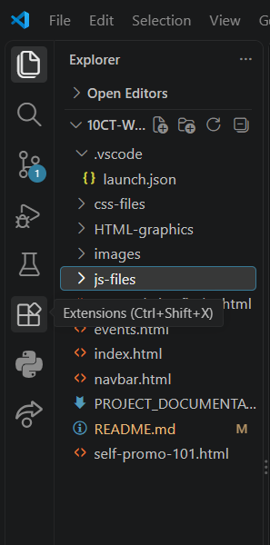
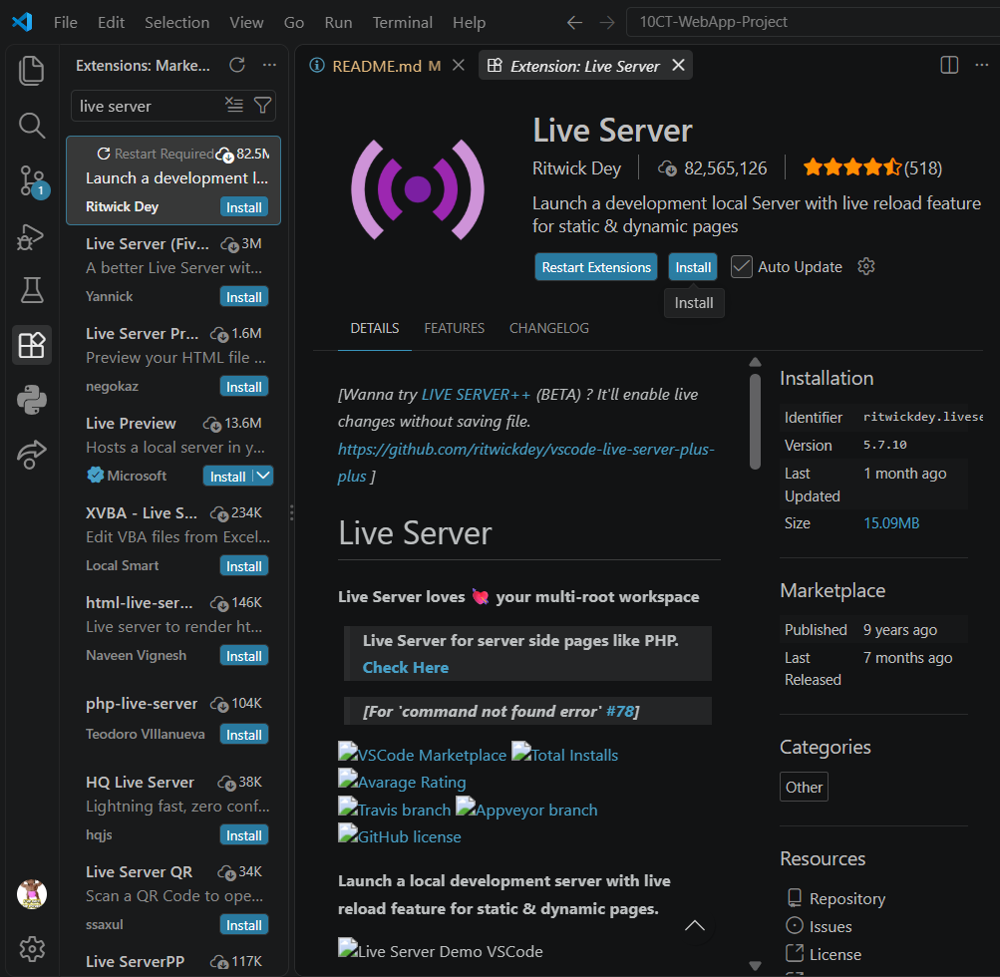
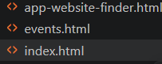
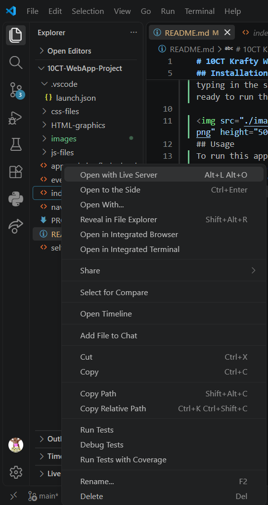

# 10CT Krafty Website Project
### Arisa Komatsu
## Overview
Krafty is an art resources application project made with HTML, CSS and Javascript. Its main purpose is to support artists and their creative journey by assisting with aspects like finding the right creative apps and websites to use, finding art events to participate and interact in, and providing a simple and easily implementable guide to promoting yourself as an artist online on social media. 
## Installation
This project requires the following dependency:
- **Live Server** for launching a development local server

You can download the Live Server Extension on VSC by clicking the extension icon on the left sidebar (in the shape of 4 squares) and typing in the search bar 'Live Server'. Click download and you are ready to run this application.

 
## Usage
To run this application: 
1. Right-click on 'index.html'

2. Press 'Open with Live Server'

---

**If you are having trouble with opening the application, you may also use this static link to access the website without Live Server:**
 https://beamish-monstera-f297c0.netlify.app/

